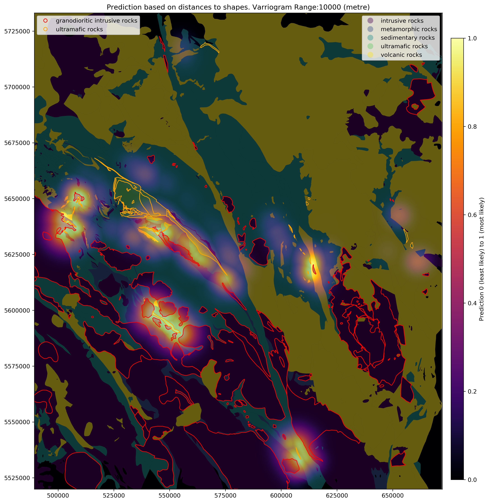

Listing of my github projects.

## Yeg Census Neighbourhoods
[yeg_census_neighbourhoods](portfolio/yeg_census_neighbourhoods.md) is a project where I looke at the 2016 census data for Edmonton neighborhoods to try to glean insights into the economic distribution of YEG residents. Learn how to use d3 to create a dashboard for visualizing GIS data was the main point of this project

## Random Stats Lessons

[Lessons](portfolio/lessons.md) is a collection of random notebooks where I am posting examples either for my posts or as reminders to myself on how to do something. It will be an ever evolving project with no rhyme or reason to its focus other then my own personal whims. Enter at your risk.

## Prospect Predictor

[Prospect Predictor](portfolio/prospect_predictor.md) is a simple prospectivity prediction package that predicts the
prospectivity of an element based on how close it is to different bedrock units.This was a fun project where I played with GIS data in python.

## Covid Alberta

[covid_alberta](portfolio/covid_alberta.md) This is a small package I developed to play around with scraping data off of websites and building a PIP installable python package.

## PyGeostat

[PyGeostat](portfolio/pygeostat.md) is a Python 3.6 module for geostatistical modeling. pygeostat is aimed at preparing spatial data, scripting geostatistical workflows, modeling using tools developed at the [Centre for Computational Geostatistics](http://www.ccgalberta.com/), and constructing visualizations to communicate spatial data. This is a project I worked with a small group of fellow grad students at the [CCG]((http://www.ccgalberta.com/))

